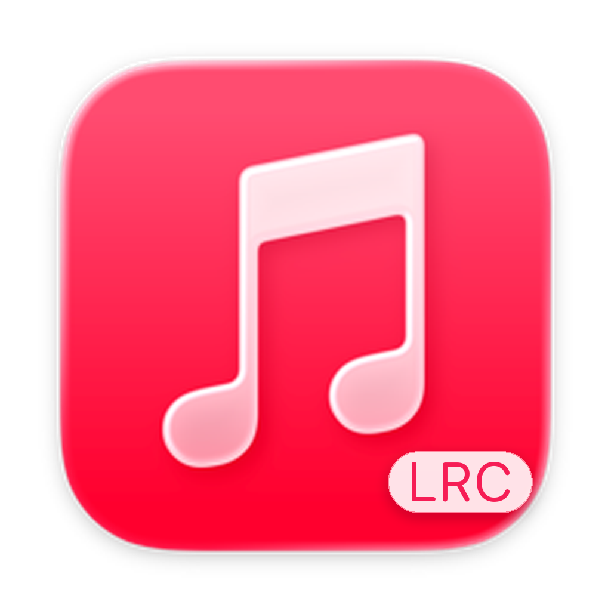

<p align="center">
  
</p>

<h1 align="center">Apple Music Bar</h1>

<p align="center">让歌词留在菜单栏，让音乐陪你工作。</p>

一个轻巧的 macOS Apple Music 菜单栏工具，随时查看歌词、控制播放，不占用桌面空间。

## 功能

- **菜单栏歌词**：随播放逐句显示，长歌词自动滚动。
- **迷你播放器**：查看封面和播放进度，切歌、暂停或跳转。
- **播放列表**：快速浏览资料库，支持歌曲列表与封面视图。
- **随你习惯**：支持开机自启，以及简体中文、繁體中文和 English。

## 开始使用

需要 **macOS 14 或更高版本**。

1. 从 [Releases](https://github.com/CrRdz/apple-music-bar/releases) 下载应用，放入“应用程序”文件夹后打开。
2. 按提示允许访问“音乐”，然后在 Apple Music 中播放歌曲。
3. 点击菜单栏歌词打开播放器，在“设置”中调整偏好或开启“开机自启”。

开机自启会在登录 Mac 后启动应用；如系统要求批准，请按提示前往系统设置。

部分歌曲可能没有可用歌词，此时会显示歌名和歌手。在线匹配歌词会使用歌曲信息，不会上传你的 Apple ID 或账号令牌。

<details>
<summary>从源码运行</summary>

安装 Xcode 或 Command Line Tools 后，在项目目录运行：

```bash
./scripts/build-app.sh
open dist/AppleMusicBar.app
```

</details>

## 许可

[MIT License](LICENSE)
